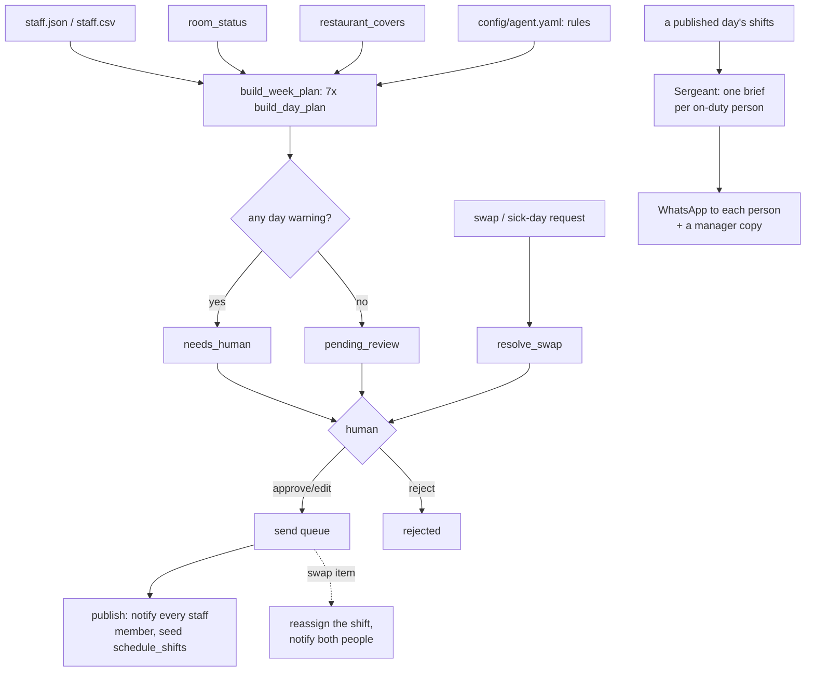

# Staff Scheduling AI — "The Planner"

Builds each rota from forecast occupancy, the real room-turn workload, the
restaurant book, and your house rules — team composition, legal and
contract limits, fairness, cost.

## What it does

**Does.** Builds each rota from forecast occupancy, the real room-turn
workload, the restaurant book, and your house rules — team composition,
legal and contract limits, fairness, cost. Every plan comes back with its
projected labour cost and any warning it couldn't resolve, and changing a
rule provably changes the plan. Publishes on manager approval and notifies
every staff member. Pairs with the Staff Briefing AI: the Planner decides
who works, the Sergeant tells them what matters today. Handles swap
requests and sick-day rebalancing automatically.

**What it won't do.** Won't publish a rota without manager sign-off, and
respects working-time rules and contracted hours as hard constraints.

**Why it matters.** Rotas are built on gut feel and redone constantly.
Matching staffing to forecast load cuts both overstaffed idle hours and
understaffed service failures.

**What to expect.** Draft rota for approval every week, matched to
forecast occupancy; swap and sickness churn handled without the manager.

**ROI.** −15% overstaffed hours (labour) — the roster's own figure for a
property that adopts workload-based staffing. See docs/benefits.md for
where that number actually comes from and its honest caveats.

## Who it's for

Any hotel with a housekeeping team and, optionally, an in-house restaurant
— small enough that the manager still builds the rota by hand or by
spreadsheet, and large enough that "who's on Thursday?" is a real weekly
decision, not one person's memory. Two teams, one engine: housekeeping
(floor-by-floor team assembly, VIP-floor coverage, supervisor span) and the
restaurant (breakfast/lunch/dinner covers-driven staffing, group and
dietary flags, sommelier scheduling). A property with no restaurant can
leave the `fnb-*` rules on; they simply never fire.

**Restaurant-only framing.** If you run a restaurant without hotel rooms,
the same engine works from the covers you expect alone — see
`config/agent.yaml: rules` and turn off the `hk-*` rules you don't need.

## How it works



**Two modes, one kill switch.** `shadow` (default): the agent reads,
thinks, drafts and queues — it never publishes a rota, never reassigns a
shift, never sends a message. `live`: an **approved** item really goes
out; everything else still waits. `config/hotel.yaml: mode` is the
switch, and it beats every other setting.

**The review loop.** Every weekly rota, every swap/sick-day match, and
every staff-briefing batch (if the sub-agent is on) waits in one queue
until a human approves, edits, or rejects it — see
`workflows/80-review.md`.

**What runs when.**

| Workflow | Cadence | Provider used |
|---|---|---|
| `workflows/10-scheduling.md` (`tools/scheduling.py`, folded into `tools/run.py`) | weekly, Monday 06:00 | one call per week (duty-manager briefing) |
| `workflows/20-swaps.md` (`tools/swaps.py`, folded into `tools/run.py`) | every 15 min, or on demand | none — pure rule matching |
| `workflows/25-staff-briefing.md` (`tools/briefing.py`, sub-agent, **off by default**) | daily 06:00 | one call per on-duty person |
| `workflows/80-review.md` (`tools/review.py`) | whenever a human is available | none |

**Sub-agent folded in.** Staff Briefing AI ("The Sergeant") — off by
default, see "Sub-agents in this repo" below.

Full detail, including the ten rule toggles and the team-assembly order:
`docs/how-it-works.md`.

## What you need

- **A team roster** — contracted hours, hourly cost, personal rules
  (days off, weekend preference). A CSV export from your HR/payroll system
  works (`data/imports/staff.csv`); no export yet is fine too, ask your
  Claude session to help you write one.
- **Today's room board and restaurant covers**, if you want live data
  instead of the bundled example hotel. Optional to start.
- **A messaging channel** for staff — WhatsApp (your own UniPile account)
  or any webhook-reachable system (SMS gateway, Slack). Optional until you
  go live; `mock` works for everything up to that point.
- **A spreadsheet**, optionally, for the published week's shift ledger —
  CSV export works with nothing to set up.
- **Claude Code**, which you already have open, or your own
  `ANTHROPIC_API_KEY` for the `anthropic` provider.

**Time to a working demo:** 5 minutes. **Time to your first real, reviewed
weekly rota:** half an hour with a real roster in hand.

## Quick start (5 minutes, no credentials)

```bash
git clone https://github.com/th1-ai/staff-scheduling-ai.git staff-scheduling-ai
cd staff-scheduling-ai
make setup
make demo
```

`make demo` runs the whole loop on the bundled example hotel — no
credentials, no network. You should see something close to this (the real
output is longer; this is the shape of it):

```
The Planner demo - Hotel Aurora, week of 2026-08-31

1) Building next week's rota from fixtures/hotel/*.json
  Mon 2026-08-31: 29 staff, 199.0h, EUR 3,035.75
  Tue 2026-09-01: 24 staff, 164.0h, EUR 2,490.00 - 6 warning(s)
  ...

  AI briefing for the duty manager:
  "Next week runs 22 to 29 staff a day across housekeeping and the
  restaurant, with Friday the tightest: dinner service jumps to 46 covers
  and we are short two servers, and Henrik's day off leaves no sommelier
  on the floor. ..."

  Week total: 33 staff, 1237.0h, EUR 18,831.50, 31 warning(s) -> status needs_human

2) A rule toggle vs a hard limit (quota-hard-cap vs the quota floor)
  Monday, quota headroom floor excludes 1 staff whether quota-hard-cap is ON or OFF (1) - it is a hard limit, never a rule toggle.
  quota-hard-cap only changes who is picked first among people who are already above that floor but close to it - never who is excluded. See docs/how-it-works.md "Design decisions".

3) Resolving swap and sick-day requests from fixtures/inbound/*.json
  swap-01 (swap, hk-06 on 2026-09-02): Priya Nair -> pending_review
  swap-03 (sick, fb-12 on 2026-09-05): NO ELIGIBLE COVER -> needs_human
  ...

4) Staff Briefing preview (sub-agent is OFF (the default) in this demo's own bundled config/agent.example.yaml - ...)
  Lucia Ferreira (pt): Lidera o Piso 1 hoje. Quarto 101 e VIP - ...
  ...

DEMO OK — 5 items processed, 5 drafted, 0 sent (shadow)
```

Nothing was sent or published — `make demo` always runs in shadow mode on
sample data, whatever your real config says. Next: open `claude` in this
folder and follow "Set up with Claude Code" below.

## Set up with Claude Code

Open `claude` in this folder. Paste each prompt below when you reach that
phase — Claude follows the named workflow file.

**Phase 1 — first run.**

> Read `workflows/00-setup.md` and walk me through it. I want to get this
> agent running for my hotel.

**Phase 2 — build and review your first real week.**

> Read `workflows/10-scheduling.md`. Build next week's rota, then show me
> the result and walk me through every warning in plain language.

**Phase 3 — swap and sick-day cover.**

> Read `workflows/20-swaps.md`. I want to log a swap request and see what
> it does.

**Phase 4 — the review queue.**

> Read `workflows/80-review.md`. Show me what's waiting for me and help me
> approve, edit or reject it.

**Phase 5 — going live.**

> Read `workflows/90-go-live.md`. Walk me through the checklist and tell me
> honestly whether we're ready.

**Optional — the Staff Briefing sub-agent.**

> Read `workflows/25-staff-briefing.md`. I want to turn on personalised
> daily staff briefs and see one.

## Connect your systems

This agent uses two adapter families — Messaging and Sheets. (`make doctor`
also pings PMS and Email, which every repo in this family has, but The
Planner's own tools never call either — see docs/integrations.md for why.)

| System | Adapter | Status | Needs |
|---|---|---|---|
| Messaging | `mock` | universal | nothing — what `make demo` uses |
| Messaging | `unipile` | **built** | your own UniPile account, your own WhatsApp number |
| Messaging | `webhook` | universal | any URL — Zapier, Make, n8n, your own endpoint |
| Sheets | `csv` | universal | nothing — writes `data/exports/*.csv` |
| Sheets | `google` | **built** | a service account JSON |

```bash
make doctor
```

tells you exactly what is configured and reachable right now. Full setup
steps for each adapter, plus how to point your own staff/room/covers data
at this agent (CSV import, columns and all): `docs/integrations.md`.

## Run it

```bash
make run                        # build the week (if not built) + resolve swap requests
make run ARGS="--dry-run"       # compute everything, write nothing
make run ARGS="--swaps-only"    # just swap/sick requests, skip the weekly build
make watch                      # keep running on the configured interval
make review                     # what is waiting for a human
make report                     # what the agent did, and what it cost
```

**Swap requests need their own file.** `make run` reads real swap and
sick-day requests from `data/imports/swap_requests.csv` (columns: `id,
staff_id, date, reason, note`) — it never falls back to the bundled example
hotel's `fixtures/inbound/*.json`, on a real run or on the scheduled
`schedule.swaps` job. With no file connected, `make run` says "no swap
requests file connected" and resolves zero requests; `make doctor` shows
the same as a WARN until the file exists. Log requests directly instead
with `python3 tools/swaps.py request ...`, or see
`workflows/20-swaps.md` and `docs/integrations.md` for the full column
list and both ways in.

**Scheduling.** `config/agent.yaml: schedule` lists every recurring job
with its own command and cadence:

```bash
make schedule ARGS="--all"
```

prints one ready-to-paste snippet per job — cron, launchd (macOS laptop),
or systemd (Linux server):

```bash
make schedule ARGS="--target launchd"
make schedule ARGS="--target systemd --cadence hourly"
```

See `scheduler/` for the example files and `workflows/00-setup.md` /
`docs/how-it-works.md` "What runs when" for what each job actually does.

**Subscription or API, honestly.** Start on `llm.provider: interactive` or
`claude-code` — your existing Claude Code subscription, flat monthly cost,
genuinely the cheapest way to run one hotel's weekly rota (two LLM calls a
week, plus one per person a day if you turn the Staff Briefing sub-agent
on). Anthropic's usage policy applies to automated use of a personal
subscription; a couple of scheduled runs a day is normal, hammering it
around the clock is not. Move to `llm.provider: anthropic` with your own
API key for volume or unattended production use — `make report` shows
exactly what you are spending. See docs/safety.md "Subscription or API: an
honest note".

## Go live

**Shadow → live checklist** (full detail in `workflows/90-go-live.md`):

- [ ] A real weekly rota reviewed end to end, not just the demo.
- [ ] `config/hotel.yaml` has your real property details.
- [ ] Your team roster is accurate — contracted hours and quotas especially.
- [ ] `config/agent.yaml: working_time` matches local law and your contracts.
- [ ] `make doctor` is clean.
- [ ] Messaging is configured and reachable.

Then:

```bash
python3 tools/review.py stale     # clear anything queued while you were testing
```

and set `mode: live` in `config/hotel.yaml`. Flip it back to `shadow` any
time to stop every outbound action immediately, mid-schedule.

## Guardrails & safety

**Never does:**

- Publish a rota without an explicit approval — `Generate` only ever
  produces a `draft`/`needs_human` item; publishing is a separate,
  deliberate `tools/review.py send`.
- Loosen a working-time limit to fill a gap. Contracted hours, rest between
  shifts, and maximum consecutive days are enforced unconditionally by
  excluding a person from the candidate pool — never gated by a rule
  toggle (`quota-hard-cap` only governs a soft preference above the
  contracted-hours floor, not the floor itself), and never by a post-hoc
  check that could be argued around.
- Offer a swap/sick-day replacement who was excluded from the original
  plan by the same rules.
- Invent a name, a number, or a warning in a narrative — both LLM prompts
  work only from the JSON the deterministic engine already computed.

**Escalates to a human (`needs_human`)** whenever a day's plan has a
warning (a short floor team, a missing supervisor, an unfilled sommelier
slot, an acting-lead promotion), whenever a swap/sick-day request has no
eligible cover, and whenever a request names a staff id that does not
exist.

**Data handling.** Your team roster (`fixtures/hotel/staff.json` /
`data/imports/staff.csv`) holds contact details, contracted hours and pay
rates — treat it like any HR export. Nothing leaves the machine on
`mock`/`interactive`; on `anthropic`/`claude-code`, the prompt context sent
to the model never includes an hourly rate. Everything lives in
`data/` (gitignored): `data/agent.db`, `data/logs/*.jsonl`, `data/exports/`. No cloud
service behind this repo, no telemetry.

**AI disclosure.** The Staff Briefing sub-agent's messages are internal
(staff, not guests), but the same transparency principle applies — tell
your team plainly that their morning brief is written by an AI reviewed by
management, and give them an easy way to flag something wrong with it. A
line like this in your rollout message covers it:

> These morning briefs are written by our scheduling AI from the published
> rota and PMS notes, and reviewed before anyone sees them. Tell your
> manager if anything in yours looks wrong.

Full detail: `docs/safety.md`.

## Sub-agents in this repo

### Staff Briefing AI — "The Sergeant"

**Does.** Every morning it pulls the day's arrivals, departures, and guest
notes from the PMS plus the cleaning schedule, reasons over them, and
sends each on-duty staff member a personalised WhatsApp brief of their
tasks, automatically.

**Won't.** Doesn't assign new tasks beyond the PMS/schedule; reads the
roster, doesn't manage it.

**Why.** Replaces the manager's daily scramble and makes sure VIP notes
and special requests actually reach the person on the floor.

**Output.** Saves a manager ~30–45 min every morning; gets guest notes to
staff with ~100% reliability.

**Off by default** — The Planner is fully useful without it. Turn it on
with `config/agent.yaml: subagents.staff_briefing.enabled: true` once you
also want a personal, per-language daily brief for each person. See
`workflows/25-staff-briefing.md` and `docs/sub-agents.md` for exactly what
is different from the source demo and how delivery is tracked.

## Customising

- **`knowledge/staffing-policy.md`** — the ten rule toggles and the
  always-on working-time limits, in plain language. Read this with the
  hotel before turning anything off.
- **`config/agent.yaml: rules`** — the ten toggles (docs/how-it-works.md
  has the full table). Flip one, rebuild a week, see the plan change.
- **`config/agent.yaml: working_time` / `housekeeping` / `fnb`** — every
  threshold the engine uses (max team size, covers-per-server, quota
  headroom floor, and more) is a config value, never hardcoded.
- **`prompts/duty-manager-briefing.md` / `prompts/staff-brief.md`** — how
  the two narrative calls are asked to write. Plain markdown, editable
  without touching Python.
- **Adding a language** for the Staff Briefing sub-agent — add the code to
  `config/agent.yaml: subagents.staff_briefing.languages` and set the
  matching staff member's `language` field in `fixtures/hotel/staff.json`
  / `data/imports/staff.csv`.

## Troubleshooting & FAQ

**`make demo` fails.** Something is wrong with the clone, not your setup —
`make demo` never reads real config. Run `python3 tools/demo.py` directly
for the full error.

**`make doctor` shows a FAIL.** Every line has a `->` fix hint. Follow it.

**"the week is already built".** Not a bug — a weekly rota is idempotent
per ISO Monday. Review the existing item, or build a different
`--week-start`.

**A swap keeps coming back "NO ELIGIBLE COVER".** Check how many people
hold that exact role. If it is genuinely one person, that is an honest
staffing gap, not a matching bug.

**"nothing published yet" from the Staff Briefing sub-agent.** It reads
the *published* roster (`schedule_shifts`) — publish a week first.

**A command exits 3.** Not an error — `llm.provider: interactive` is
waiting for your answer in `data/pending/`. Read the prompt, write the
answer, re-run.

Full list: `workflows/99-troubleshooting.md`.

## Measuring the benefit

```bash
make report
```

shows weekly rotas queued and how many needed a human, swap/sick requests
resolved (and how many had no eligible cover — a real staffing signal),
published weeks and the shift ledger behind them, staff briefs delivered
(once the sub-agent is on), and LLM spend.

**Track week over week:** warning count per week (falling = your rules and
roster size are converging on real demand), cost saved vs the baseline
(once `cost-optimise` is on), and swap requests with no eligible cover
(rising = a real depth-of-bench problem, not something the software can
match its way around).

Honest caveats, and exactly what −15% does and does not promise:
`docs/benefits.md`.

## About

Built by [TH1](https://th1.ai) — AI agents for independent hotels.

Licence: MIT (see `LICENSE`).

Want this running for your property without building it yourself?
[th1.ai](https://th1.ai) sets it up, connects your systems, and keeps it
current.

**Changelog.** v1 — first release: weekly rota engine (ten rule toggles,
always-on working-time limits), swap/sick-day cover, the Staff Briefing
sub-agent (off by default), CSV import for your own roster/room/covers
data.
