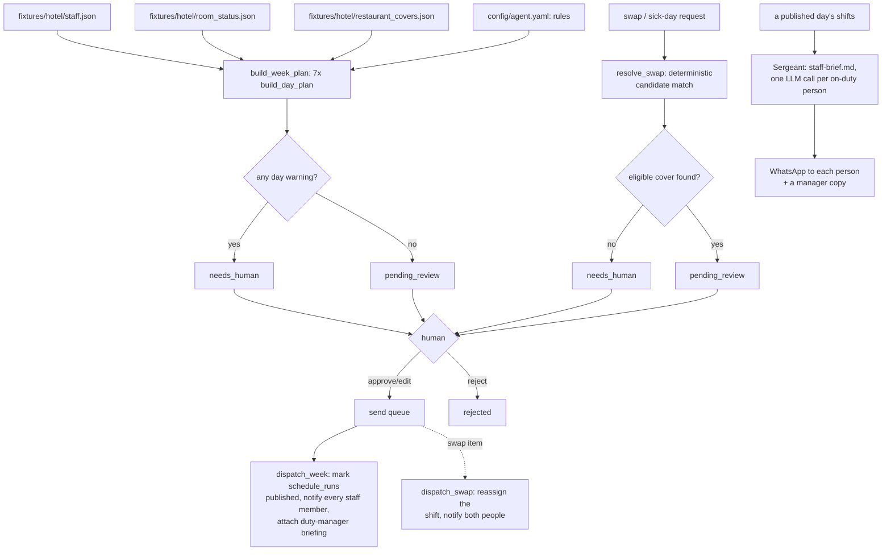

# How The Planner works

Two deterministic engines and two kinds of LLM call that never touch a
number, only the words around it (ARCHITECTURE.md section 1: "deterministic
decisioning, LLM for language"). `tools/engine.py` builds the week's rota
and resolves swap/sick-day cover; the only two things a model ever does are
write the duty-manager narrative that goes with a published rota, and (if
you turn on the folded Staff Briefing AI sub-agent) write one short brief
per on-duty person.

## The loop

`tools/engine.py` is the whole decision layer: `build_week_plan()` and
`resolve_swap()`, both pure functions over plain dataclasses, no I/O. The
model never sees a shift before the engine has already decided it — every
number in the duty-manager briefing and every staff-brief line is read out
of the engine's own output, never invented.

## What runs when

| Workflow | Cadence | Provider used |
|---|---|---|
| `workflows/10-scheduling.md` (`tools/scheduling.py`, folded into `tools/run.py`) | weekly, Monday 06:00 (`config/agent.yaml: schedule.weekly_rota`) | one call (`duty-manager-briefing`) per week generated |
| `workflows/20-swaps.md` (`tools/swaps.py`, folded into `tools/run.py`) | every 15 min, or on demand (`config/agent.yaml: schedule.swaps`) | none — swap/sick-day resolution is pure rule matching |
| `workflows/25-staff-briefing.md` (`tools/briefing.py`, sub-agent, **off by default**) | daily 06:00 (`config/agent.yaml: schedule.staff_briefing`) | one call per on-duty person that day (`staff-brief`) |
| `workflows/80-review.md` (`tools/review.py`) | whenever a human is available | none — queue operations only |
| `tools/review.py send` | after an approval | the messaging/sheets adapters' writes |

## The ten rule toggles (`config/agent.yaml: rules`)

Every rule is read straight out of config and changes the plan on the next
`make run` / `make demo` — nothing is cached across a toggle, so "change a
rule and the plan provably changes" (the roster's own words) is literally
true of every run, not a demo trick.

| Rule | On (default) | Off |
|---|---|---|
| `personal-rules` | A staff member's `days_unavailable` and `weekend_rule` exclude them from that day's candidate pool. | Everyone is offered every day regardless of their personal rules. |
| `quota-hard-cap` | A **soft** preference: candidates still within `quota_soft_preference_hours` of the (always-enforced) `quota_headroom_floor_hours` floor are picked last, never excluded. | No preference for headroom when ranking — `fairness-quota`/`cost-optimise`/roster order decide alone. Anyone actually below the floor is excluded either way — see the note below. |
| `fairness-quota` | Among tied candidates, the one with the most monthly headroom is picked first. | Candidates are picked in roster order — first come, first assigned. |
| `cost-optimise` | Ties break on the cheapest `hourly_cost`; a savings line is shown when the week beats the baseline by `cost_savings_floor`. | No cost tiebreak, no savings line. |
| `hk-team-mix` | Every floor team gets a senior (`hk-senior-years` or more) as lead over the juniors. | Floors are staffed with whoever is available, no lead structure. |
| `hk-vip-floor` | A floor with a VIP room additionally requires a `vip_cleared` lead. | Any senior can lead a VIP floor. |
| `hk-supervisor-span` | Up to `hk-max-supervisors` supervisors split the floors between them and inspect every checkout in their block. | No supervisor layer; team leads self-inspect. |
| `fnb-ratios` | Servers/runners/bartenders are sized off `fnb.covers_per_server` etc. | Every service is staffed at a flat `fnb.flat_ratio` covers-per-server instead. |
| `fnb-group-senior` | A group booking or a dietary flag pulls an allergy-trained or senior server first. | Servers are assigned in roster order regardless of group/dietary flags. |
| `fnb-sommelier` | Dinner gets a sommelier when covers exceed `fnb.sommelier_covers_floor` or an occasion mentions tasting/wine. | No sommelier is ever pulled, even for a wine dinner — a warning explains why. |

**Working-time limits are not on this list** — the roster's own `cant`
promises the agent "respects working-time rules and contracted hours as
hard constraints", so `max_consecutive_days`, `min_rest_hours` **and the
quota headroom floor** (`quota_headroom_floor_hours`, all three in
`config/agent.yaml: working_time`) are always enforced by excluding a
person from the candidate pool, whatever any rule toggle says — including
`quota-hard-cap`, which only governs the soft preference described above,
never the floor itself. See "Design decisions" below.

## Team assembly, in order

For each of the 7 days: **(1) availability** — exclude by personal rules
and the three always-on working-time limits (max consecutive days, min
rest, quota headroom floor), each counted separately in the thinking log;
**(2) housekeeping** — bucket rooms by
floor, `minutes = checkouts×35 + stayovers×20 + arrivals×10`,
`needed = clamp(1..hk-max-team-size, ceil(minutes / shift_minutes))`, a
senior leads if `hk-team-mix`, and a floor that cannot find one promotes
its most experienced junior with a named warning; **(3) supervisors** —
up to `hk-max-supervisors`, ranked by experience, each covering
`ceil(floors / n)` contiguous floors; **(4) restaurant** — for each service
(breakfast/lunch/dinner), `servers = max(2, ceil(covers / ratio))`,
runners/bartenders/hosts/sommelier follow the ratios above, a service lead
is assigned to every service but the one with the smallest cover count;
**(5) verification** — "N assignments verified, 0 quota breaches, 0
working-time violations, 0 personal-rule conflicts" is true by
construction, because an excluded person is never in the pool to begin
with; **(6) cost pass** — baseline = average hourly cost of the day's
available pool × hours actually assigned, savings shown when `cost-optimise`
is on and the gap clears the floor.

## Deciding what needs a human

- **A weekly rota** is `needs_human` when any day in the week has a
  warning (a short floor team, a missing supervisor, an unfilled sommelier
  slot, an acting-lead promotion); otherwise `pending_review`.
- **A swap or sick-day request** is `needs_human` when no eligible
  replacement exists for that role/day; otherwise `pending_review`. The
  matching itself is always automatic — see "Design decisions".
- **Publishing** never happens without an explicit approval, whatever the
  mode — the roster's own `cant` line says so and `tools/review.py` is the
  only door out.

## Idempotency

- `store.upsert_item("weekly-rota", "<week_start_date>", ...)` is unique
  per ISO week — a second `tools/run.py --once` the same week returns the
  existing draft untouched (`item.intent` is only set once the plan has
  been computed).
- `store.upsert_item("swap", "<request_id>", ...)` is unique per request;
  re-submitting the same request id is a no-op.
- Sending is claimed atomically (`Store.claim_for_send()`): two runners
  racing on the same approved item can never both publish/reassign twice.
- `schedule_shifts` rows (see `tools/store_ext.py`) are written once per
  `(run_id, staff_id, day_offset)` when a weekly rota is approved and sent
  — never on a dry run, and never before the item has cleared review.

## Design decisions where the spec was open

`specs/staff-scheduling-ai.md` section 11 and `specs/staff-briefing-ai.md`
section 11 left several questions for whoever built the real template.
Here is what this one does about each:

1. **Swap requests and sick-day rebalancing had no demo surface at all.**
   This template adds `tools/engine.py:resolve_swap()` — deterministic
   candidate matching (same role/department, not excluded by the working
   day's personal-rules/quota/working-time checks, ranked by fairness
   headroom then cost) — plus `tools/swaps.py` and `workflows/20-swaps.md`.
   "Handled automatically" describes the *matching*: the AI works out who
   can cover without anyone re-juggling the roster by hand. The
   notification that follows is still an outbound message and goes
   through the same review guard as everything else in this family —
   shadow blocks it, live mode still queues it for a quick approve. That
   is a deliberately more honest reading of "without the manager" than
   silently bypassing `core.review`.
2. **Monthly vs daily cadence.** This template ships **weekly**, matching
   the roster's own output line ("Draft rota for approval every week"),
   not the demo's day-by-day generator or the workflow canvas's
   last-Monday-of-month trigger. `config/agent.yaml: schedule.weekly_rota`
   builds the next Monday-to-Sunday week in one pass.
3. **`hours_worked_mtd` is read for quota headroom but not written back**
   here either. This agent is not the source of truth for hours actually
   worked — a real deployment should sync it from payroll or the PMS's
   clock-in data, not from this agent's own draft output, which may never
   be approved as drafted.
4. **The ten `rule_text` wordings** are authored fresh in
   `knowledge/staffing-policy.example.md` since the source demo's seeded
   copy is not in this repo.
5. **Working-time limits are implemented, not left out**, because the
   roster's `cant` line promises them as a hard constraint (see the table
   above) — this template does more here than the source demo, on
   purpose, rather than promise something it does not enforce.
6. **A `language` field is added to `fixtures/hotel/staff.json`** — the
   source table has none, but the Staff Briefing sub-agent cannot write a
   brief "in their language" without one. That field is checked against
   `subagents.staff_briefing.languages` before it is ever used
   (`tools/briefing.py:resolve_briefing_language`) — a code that is not on
   the list, or a blank cell, falls back to `hotel.languages[0]` and flags
   that day's briefing batch `needs_human` with the reason, rather than
   handing an unvetted string to the model.
7. **Delivery is recorded.** `schedule_briefs` (`tools/store_ext.py`) logs
   one row per person per day with a `delivered` flag, so "~100%
   reliability" is something you can actually audit instead of an
   unmeasured claim.
8. **VIP-note routing** is a plain lookup: a note attached to a room goes
   into the brief of whoever is assigned that room (housekeeping) or that
   table's service (restaurant) that day — matched off the same
   `ShiftAssignment.rooms`/`service` fields the engine already produces,
   nothing invented beyond that.
9a. **The Sergeant's sends are still gated, once a day, not once a person.**
   "Sends... automatically" describes the *composing*: one LLM call per
   on-duty person, no manager drafting involved. Every `core.review`-guarded
   write still needs an approved item, so this template batches the whole
   day's briefs into one review item (`kind: staff_briefing`) instead of
   asking a manager to click approve fourteen times before breakfast. Shadow
   blocks the batch exactly like everything else; a manager reviews and
   sends the whole day's briefs in one `tools/review.py send`.
9. **Trigger cadence for the Sergeant.** This template ties the daily
   brief to the *published* roster, run every morning independent of the
   Planner's own weekly cadence — the option `specs/staff-briefing-ai.md`
   section 11 flags as open ("whether both stages exist"). The weekly
   Publish approves the staffing commitment once; the daily job sends that
   day's brief off the already-published week, so a manager is not
   clicking Publish every morning for briefs to go out.

## Where core stops and this agent starts

`core/` is byte-identical to `factory/core/` and shared by every repo in
this family. Everything in `tools/`, `prompts/`, `fixtures/`, `workflows/`,
`knowledge/` and `config/agent.example.yaml` is The Planner's own.
